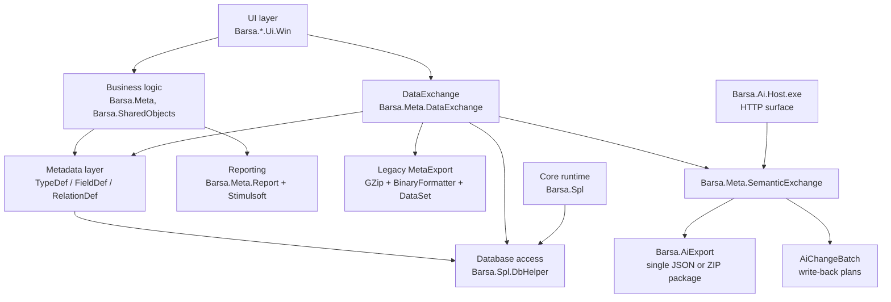

# Architecture

> Generated by `tools/` from the inputs in `source/`. Every statement below is backed by assembly metadata, IL, or a supplied export sample.
> Anything that could not be proven from those inputs is marked **Unknown** rather than guessed.

Layers below are named only where assembly metadata shows the types that
constitute them. Assembly names are the primary evidence; the role ascribed to
each layer is Observed from its public type surface.

## Core runtime — `Barsa.Spl.dll`

Foundation assembly. Referenced by essentially every other Barsa assembly, which
is why it is placed at the bottom of the stack.

Representative types: `Barsa.Spl.DbExecutionExtender`, `Barsa.Spl.DbExecutionExtender+#8cd`, `Barsa.Spl.DbExecutionExtender+Settings`, `Barsa.Spl.DbFieldMapper`, `Barsa.Spl.DbHelper`, `Barsa.Spl.DbHelper0`

## Metadata layer — `Barsa.Meta.dll`

Holds the metamodel that a Barsa "system" is made of. The entity/field/relation
triple here maps one-to-one onto the export package's `MET_TYPEDEF`,
`MET_FIELDDEF` and `MET_RELATIONDEF` tables, which is the strongest
cross-source result in this pack (see `evidence/cross-validation.md`).

## Business logic

`BusinessLogic` / `BusinessLogicBase` / `DefaultBusinessLogicBase` are searched
for per spec section 38. Findings: see `domains/business-logic.md`.

## Database access

`Barsa.Spl.DbHelper` is the recurring call target in data paths
(`LoadList`, `CreateParameterByValue`). Raw SQL fragments recovered from IL
string literals are in `evidence/sql-fragments.md`.

## UI

WinForms. Barsa derives its forms from
`Barsa.Spl.Win.InfraComponents.Forms.BarsaBaseForm` and uses Janus, Actipro,
DevExpress-style control suites plus its own `Barsa.SPL.Win.*` family.

## Reporting

`Barsa.Meta.Report` plus the Stimulsoft report engine
(`Stimulsoft.Report.dll` and friends). See `domains/reporting.md` and
`domains/stimulsoft.md`.

## Data exchange — two assemblies, two formats

The subject of this pack's deepest analysis.

`Barsa.Meta.DataExchange.dll` holds the legacy half and the public façade.
`BixHelper` fronts a matched `NewExportManager` / `NewImportManager` pair, and
`SerializationHelper2` is the GZip + BinaryFormatter writer and reader.

`Barsa.Meta.SemanticExchange.dll` holds the AiExport half: the JSON projection
(`BixJsonExportManager`, `JsonExportDocumentBuilder`, `JsonExportPackageWriter`),
the change-plan write path (`BixWriteHelper`, `AiChangePlanner`,
`AiBatchExecutor` and fourteen `Ai*ChangeProvider` types), and the package diff
engine (`BixSnapshotManager`).

It declares its types in the `Barsa.Meta.DataExchange` *namespace* while being a
separate assembly, and the dependency runs DataExchange → SemanticExchange.
A namespace-scoped search finds nothing, which is worth knowing before trusting
any search of this codebase.

`Barsa.Ai.Host.exe` puts an HTTP surface (`AiHttpServer`) over the semantic
engine: plan, apply, lint, snapshot-diff and knowledge read/write.

See `domains/data-exchange.md`, `domains/legacy-metaexport.md`,
`domains/ai-export.md` and `formats/`.
