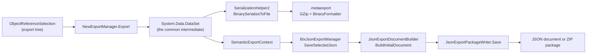

# Barsa.AiExport format

> Generated by `tools/` from the inputs in `source/`. Every statement below is backed by assembly metadata, IL, or a supplied export sample.
> Anything that could not be proven from those inputs is marked **Unknown** rather than guessed.

**Logical format:** `Barsa.AiExport` · **Producer:** `Barsa.Meta.SemanticExchange`

## The headline

AiExport is **not** a second extraction path. It is a **projection of the same
DataSet** the legacy export collects:

Evidence for the shared trunk: `BixHelper.ExportJson` constructs a
`NewExportManager` and calls its `Export`, passing a callback that builds a
`SemanticExportContext` from `ExportSaveContext.DataSet`. The hand-off into the
semantic engine is a delegate call, so the proof is the MemberRef row in
`Barsa.Meta.DataExchange` naming
`BixJsonExportManager::SaveSelectedJson` — compiled-against evidence, stronger
than a name match. **Confidence: CrossVerified.**

A consequence worth stating plainly: AiExport can never carry source data the
legacy DataSet did not collect. Differences between the two are projection
differences, not collection differences.

## Assembly layout, and why v2 missed this

`Barsa.Meta.SemanticExchange.dll` declares its types in the
`Barsa.Meta.DataExchange` **namespace** while being a separate assembly, and it
does not reference `Barsa.Meta.DataExchange.dll` (the dependency runs the other
way). A namespace-scoped search finds nothing. It is also **not obfuscated**,
so its member names are real.

| Assembly | Version | Obfuscated | Role |
|---|---|---|---|
| `Barsa.Meta.DataExchange` | 4.1.203.0 | yes (private members) | legacy export/import, and the BixHelper facade |
| `Barsa.Meta.SemanticExchange` | 4.1.203.0 | no | AiExport projection, change planning, write-back |
| `Barsa.Ai.Host` | 4.1.203.0 | no | HTTP surface over the semantic engine |

## The profile is the specification

`AiExportProfileLoader.LoadEmbedded` reads a JSON rule document shipped as a
manifest resource. That document, not a sample, is the authoritative description
of the format.

| Resource | profileVersion | Bytes | Record types | Serialized types | Enums | Binary decoders |
|---|---|---|---|---|---|---|
| `Barsa.Meta.SemanticExchange.Helper.Bix.Export.AiExportProfile.ai-export-profile.json` | 14 | 217950 | 44 | 165 | 54 | 12 |
| `Barsa.Meta.SemanticExchange.Helper.Bix.Export.AiExportProfile.ai-export-profile.schema.json` | 14 | 7138 | 0 | 0 | 0 | 0 |
| `Barsa.Meta.SemanticExchange.Helper.Bix.Export.AiExportProfile.ai-export-profile.v15.json` | 15 | 217950 | 44 | 165 | 54 | 12 |
| `Barsa.Meta.SemanticExchange.Helper.Bix.Export.AiExportProfile.ai-export-profile.v15.schema.json` | 15 | 7142 | 0 | 0 | 0 | 0 |

Sections: `binaryDecoders`, `engine`, `enums`, `packaging`, `profileVersion`, `recordTypes`, `serializedTypes`

### Engine rules (v15)

| Rule | Value | Reading |
|---|---|---|
| `unknownRecordType` | include | a record type with no rule is still emitted |
| `unknownField` | keep | a column with no rule is kept |
| `omitNull` | True | null-valued properties are dropped from the output |
| `omitDefault` | True | a property equal to its declared default is dropped |
| `binary.unknownBinary` | omit | a binary column with no decoder is dropped |
| `binary.onDecodeError` | error-marker | a decode failure is written as an error marker rather than failing the export |
| `largeCode.mode` | file | long code values become separate files |
| `largeCode.thresholdChars` | 1000 | the length at which that happens |

`omitNull` and `omitDefault` both being true matters for any comparison: an
absent property in AiExport may mean "null or default", not "missing". Treating
absence as loss would produce false positives.

### Record types

44 record types, each naming the legacy
table it projects from. This is Barsa's own Legacy-to-AiExport mapping.

| Record type | Legacy table | Output | Fields | Omitted | References | Decoders |
|---|---|---|---|---|---|---|
| `Barsa.Meta.BRRule` | `met_RuleDef` | auto | 11 | 1 | 1 | 0 |
| `Barsa.Meta.FieldDef` | `met_FieldDef` | inline | 16 | 4 | 0 | 1 |
| `Barsa.Meta.Folder` | `met_Folder` | folder | 16 | 3 | 3 | 0 |
| `Barsa.Meta.MailViewGroup` | `met_MailViewGroup` | file | 6 | 1 | 1 | 0 |
| `Barsa.Meta.MetaAssembly` | `met_Assembly` | auto | 8 | 1 | 0 | 0 |
| `Barsa.Meta.MetaCode` | `met_MetaCode` | inline | 6 | 0 | 1 | 0 |
| `Barsa.Meta.MetaCommand` | `met_MetaCommand` | file | 13 | 1 | 2 | 0 |
| `Barsa.Meta.MetaFieldDefRelation` | `met_MetaFieldDefRelation` | auto | 5 | 0 | 4 | 0 |
| `Barsa.Meta.MetaSystem` | `met_MetaSystem` | folder | 14 | 3 | 0 | 2 |
| `Barsa.Meta.MetaUserControl` | `met_MetaUserControl` | auto | 5 | 0 | 0 | 0 |
| `Barsa.Meta.RelationDef` | `met_RelationDef` | file | 12 | 1 | 3 | 0 |
| `Barsa.Meta.Report` | `met_Report` | inline | 17 | 2 | 3 | 1 |
| `Barsa.Meta.TypeDef` | `met_TypeDef` | inline | 30 | 5 | 6 | 1 |
| `Barsa.Meta.TypeDefAccessService` | `met_TypeDefAccessService` | inline | 8 | 1 | 1 | 0 |
| `Barsa.Meta.TypeDefAccessTemplate` | `met_TypeDefAccessTemplate` | auto | 6 | 0 | 1 | 0 |
| `Barsa.Meta.TypeViewEntity` | `met_TypeViewEntity` | inline | 7 | 2 | 1 | 1 |
| `Barsa.Meta.TypeViewUsingLocation` | `met_TypeViewUsingLocation` | auto | 7 | 0 | 3 | 0 |
| `Barsa.Spl.Security.SecurityGroup` | — | file | 6 | 1 | 2 | 0 |
| `Barsa.Workflow.ActivityDef` | `wfl_ActivityDef` | inline | 12 | 1 | 1 | 1 |
| `Barsa.Workflow.ChoiceDef` | `wfl_ChoiceDef` | inline | 11 | 1 | 3 | 1 |
| `Barsa.Workflow.WorkflowActorDef` | `wfl_WorkflowActorDef` | inline | 7 | 1 | 1 | 1 |
| `Barsa.Workflow.WorkflowDef` | `wfl_WorkflowDef` | inline | 16 | 2 | 1 | 2 |
| `Barsa.Workflow.WorkflowVariableDef` | `wfl_WorkflowVariableDef` | inline | 7 | 1 | 1 | 1 |
| `CAIntermediateEnd` | — | inline | 4 | 0 | 1 | 0 |
| `JsonProperty` | — | auto | 6 | 0 | 0 | 0 |
| `MetaCondition` | — | inline | 5 | 0 | 1 | 1 |
| `اطلاعات سيستم` | — | omit | 0 | 0 | 0 | 0 |
| `امكان شيء` | — | auto | 9 | 1 | 4 | 0 |
| `انتخاب انجام دهنده` | — | auto | 7 | 1 | 0 | 0 |
| `تنظيمات اتصال فعاليت فرم` | — | auto | 18 | 2 | 5 | 0 |
| `دستور پويا` | — | auto | 6 | 1 | 1 | 0 |
| `دستور-اجراي فرآيند` | — | auto | 4 | 0 | 2 | 0 |
| `دستور-اجراي كد منطق كاري` | — | auto | 3 | 0 | 0 | 0 |
| `دستور-اجراي كد واسط كاربري` | — | auto | 4 | 0 | 0 | 0 |
| `دستور-ايجاد مشابه` | — | auto | 3 | 0 | 0 | 0 |
| `دستور-نمايش پيغام` | — | auto | 3 | 0 | 0 | 0 |
| `محاسبه فيلد وابسته` | — | auto | 9 | 1 | 0 | 0 |
| `محاسبه-سمت آغاز كننده فرآيند` | — | auto | 3 | 0 | 0 | 0 |
| `محاسبه-سمت ثابت` | — | auto | 2 | 0 | 0 | 0 |
| `محاسبه-فرمول محاسبه` | — | auto | 5 | 0 | 0 | 0 |
| `محاسبه-فيلد فرم` | — | auto | 5 | 0 | 1 | 0 |
| `محاسبه-كاربر ثابت` | — | auto | 2 | 0 | 0 | 0 |
| `نوع تكرار` | — | auto | 8 | 1 | 0 | 0 |
| `وابستگي كد سيستم` | — | auto | 7 | 0 | 2 | 0 |

### Binary decoders

The legacy format's opaque blobs are **not** opaque to AiExport: the profile
names a decoder for each one.

| Record type | Field | Decoder | Implementation |
|---|---|---|---|
| `Barsa.Meta.FieldDef` | `Settings` | `FieldInfo` | `SerializeFieldInfo` |
| `Barsa.Meta.MetaSystem` | `Settings` | `MetaSystemSettings` | `SerializeMetaSystemSettings` |
| `Barsa.Meta.MetaSystem` | `SettingsBytes` | `MetaSystemSettings` | `SerializeMetaSystemSettings` |
| `Barsa.Meta.Report` | `ReportData` | `ReportData` | `SerializeReportData` |
| `Barsa.Meta.TypeDef` | `Settings` | `TypeDefSettings` | `SerializeTypeDefSettings` |
| `Barsa.Meta.TypeViewEntity` | `TypeViewBlob` | `TypeView` | `SerializeTypeView` |
| `Barsa.Workflow.ActivityDef` | `InternalData` | `ActivityDefInfo` | `SerializeActivityDefInfo` |
| `Barsa.Workflow.ChoiceDef` | `InternalData` | `ChoiceInfo` | `SerializeChoiceInfo` |
| `Barsa.Workflow.WorkflowActorDef` | `InternalData` | `ActorDefInfo` | `SerializeActorDefInfo` |
| `Barsa.Workflow.WorkflowDef` | `DiagramData2` | `WorkflowDiagramSimple` | `SerializeWorkflowDiagramSimple` |
| `Barsa.Workflow.WorkflowDef` | `InternalData` | `WorkflowDefInfo` | `SerializeWorkflowDefInfo` |
| `Barsa.Workflow.WorkflowVariableDef` | `InternalData` | `VariableDefInfo` | `SerializeVariableDefInfo` |
| `MetaCondition` | `Condition$BINARY` | `MetaCondition` | `SerializeMetaCondition` |

This resolves two things the v2 pack recorded as Unknown: `met_Report.ReportData`
has a declared decoder (`SerializeReportData`), and
`MET_TYPEVIEWENTITY.TypeViewBlob` routes through `SerializeTypeView`. The
decoders are **named**; their output shape is still Unknown, because this
extractor does not run them.

### Enums spelled out

54 enums are expanded from numeric values to
names in the profile, so AiExport output is readable where the legacy DataSet
stores integers. Full list: `index/ai-export-properties.json`.

## See also

- `formats/ai-export-single-json.md`
- `formats/ai-export-zip-package.md`
- `formats/ai-export-profile-version.md`
- `comparison/legacy-vs-ai-export.md`

## Caveat on samples

2 AiExport artifact(s) were analysed.
Everything above is read from the binary and the embedded profile. Where a
statement would need an artifact to confirm, it is marked as such.
