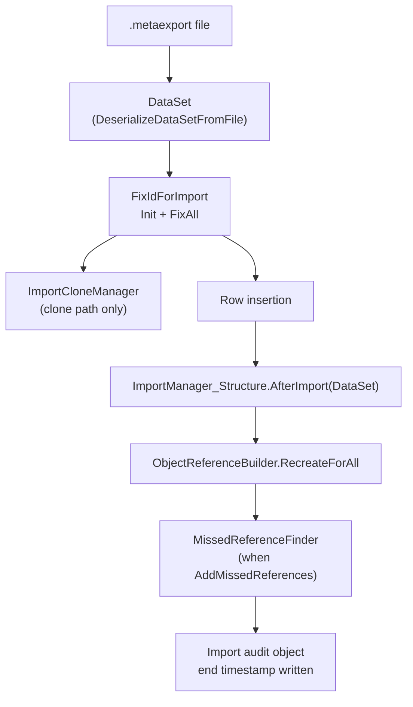

# Reconstruction order

> Generated by `tools/` from the inputs in `source/`. Every statement below is backed by assembly metadata, IL, or a supplied export sample.
> Anything that could not be proven from those inputs is marked **Unknown** rather than guessed.

**Confidence: Observed.** Edges are read off the call sequence inside
`Barsa.Meta.DataExchange.NewImportManager::Import`. IL was walked as a flat
opcode stream, so these are the stages the importer *invokes*; branch conditions
and loop structure were not recovered.

Per spec section 20, nothing here was assumed in advance.

## Edges

| From | To | Reason | Evidence | Confidence |
|---|---|---|---|---|
| Package file | DataSet | NewImportManager::Import calls SerializationHelper2.DeserializeDataSetFromFile before anything else touches the data. | CallGraph | Observed |
| DataSet | Id remap (FixIdForImport) | Import constructs FixIdForImport and calls Init/FixAll on the DataSet before rows are written. | CallGraph | Observed |
| Id remap (FixIdForImport) | Row insertion | ImportOptions.out_IdFixer is published after the fixer runs, and clone-name fixing operates on the same DataSet. | CallGraph | Observed |
| Row insertion | ImportManager_Structure.AfterImport | Import calls ImportManager_Structure::AfterImport(DataSet) near the end of the method body. | CallGraph | Observed |
| ImportManager_Structure.AfterImport | ObjectReferenceBuilder.RecreateForAll | Import calls ObjectReferenceBuilder::RecreateForAll after AfterImport, rebuilding the navigable object graph. | CallGraph | Observed |
| ObjectReferenceBuilder.RecreateForAll | Missed reference resolution | MissedReferenceFinder is invoked when ImportOptions.AddMissedReferences is set. | CallGraph | Observed |

## What this does *not* establish

- The order in which **individual tables** are written. The call graph shows
  stage boundaries, not per-table sequencing. Whether entities precede fields
  precede relations at the row level is **Unknown** from static analysis, even
  though it is the natural reading.
- Whether any stage is **deferred** to a second pass. `AfterImport` and
  `RecreateForAll` running last is consistent with deferral but does not prove it.
- Transaction boundaries. See `RUNTIME-GAPS.md`.

The spec's hypothetical `System → Entities → Fields → Relations → Reports`
ordering is **not** reproduced here, because no evidence in the supplied inputs
establishes it.
