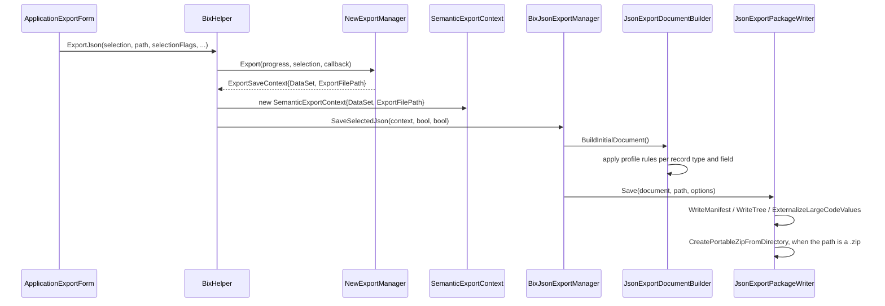

# Scenario: export a system as AiExport JSON

> Generated by `tools/` from the inputs in `source/`. Every statement below is backed by assembly metadata, IL, or a supplied export sample.
> Anything that could not be proven from those inputs is marked **Unknown** rather than guessed.

## Preconditions

- A logged-in session with a live database connection.
- An `ObjectReferenceSelection` from the export tree — the same selection object
  the legacy export uses.
- The embedded profile at `profileVersion` 15.

## Input

```
BixHelper.ExportJson(ObjectReferenceSelection, string path,
                     BixJsonExportSelection, bool, bool) : bool
BixHelper.ExportJson(ObjectReferenceSelection, string path,
                     BixJsonExportMode, bool, bool) : bool
BixHelper.ExportInitialJson(ObjectReferenceSelection, string, bool, bool) : bool
```

## Flow



The UI entry point is `ApplicationExportForm.btnExport_Click`, which calls
`BixHelper.ExportJson` when the JSON checkbox is set and `BixHelper.Export`
otherwise — and rejects an empty type selection with
`'حداقل یک نوع خروجی JSON باید انتخاب شود.'` ("at least one JSON output type
must be selected"), which is the `BixJsonExportSelection` flags enum surfacing in
the UI.

## Side effects

Writes a JSON document, or a directory that is then zipped. No database write.

## Failure modes

- `'Export dataset is empty.'` and `'Export file path is empty.'`
- `'Semantic runtime export accepts only profileVersion=15.'`
- `'No JSON export files were created.'`
- A binary column with no decoder is dropped; a decode failure becomes an
  error marker in the output rather than failing the export
  (`engine.binary.onDecodeError = error-marker`).

## Confidence

**Verified** for the API surface, the pipeline and the profile rules.
**Unknown** for the resulting bytes, since no AiExport artifact was supplied.
