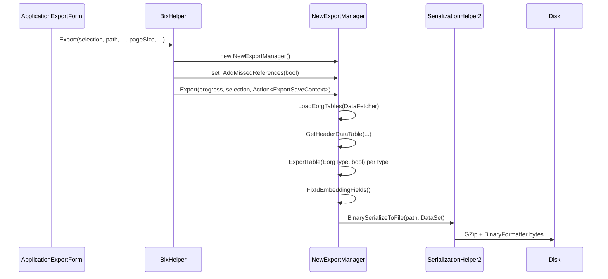

# Scenario: export a system (legacy MetaExport)

> Generated by `tools/` from the inputs in `source/`. Every statement below is backed by assembly metadata, IL, or a supplied export sample.
> Anything that could not be proven from those inputs is marked **Unknown** rather than guessed.

## Preconditions

- A logged-in Barsa session with a live database connection.
- The operator has selected nodes in the export tree, producing a
  `Barsa.Meta.DataExchange.ObjectReferenceSelection`.

## Input

`ObjectReferenceSelection`, whose public surface is:

```
List<ObjectReferenceNode> SelectedNodes      // what the operator ticked
List<ObjectReferenceFilter> Filters
string[] ExtraTablesToMap
Nullable<DateTime> MinDate                   // "changed since" filter
Action<NewExportManager> ExportAction
string GetDisplayName()
void RemoveCategoryFromFilters(int[])
```

The tree itself is fed by `ExportDataSource : IActiveDataSource`:

```
IEnumerable<DataRow> ObjectReference_GetRootList()
IEnumerable<DataRow> ObjectReference_GetChildren(long parentObjectId)
DataRow GetObjectDataRow(long objectId)
```

## Flow

Observed from the call graph:



## API / types

| Member | Signature |
|---|---|
| Façade | `BixHelper.Export(ObjectReferenceSelection, string, bool, int, bool) : bool` |
| Façade (prompting) | `BixHelper.Export(ObjectReferenceSelection) : bool` |
| Façade (simple) | `BixHelper.Export(SimpleExportSelection, string) : bool` |
| Engine | `NewExportManager.Export(MultiSubProgress, ObjectReferenceSelection, Action<ExportSaveContext>) : void` |
| Per-type | `NewExportManager.ExportTable(Barsa.Spl.BasicInfo.EorgType, bool) : void` |
| Id prep | `NewExportManager.FixIdEmbeddingFields() : void` |
| Header | `NewExportManager.GetHeaderDataTable(string, DataFetcher) : DataTable` |
| Closure | `NewExportManager.GetExternalRefrences(MultiSubProgress, ObjectReferenceSelection) : long` |
| Closure types | `NewExportManager.GetExternalRefrencingTypeDefs(ObjectReferenceSelection) : MetaObjectList` |
| Session | `ExportSessionHelper.CreateExportSessionAndPrepareSeletion(ObjectReferenceSelection, out string) : ExportSession` |
| Write | `SerializationHelper2.BinarySerializeToFile(string, DataSet) : void` |
| Paging | `ExportFileNameHelper.GetExportFileName(string, int, bool) : string` |

Barsa's own misspellings (`Refrences`, `Seletion`) are preserved — they are the
real identifiers.

## Side effects

- Writes one or more `.metaexport` files.
- Creates an export session row; `$Selection` and `$RootSelection` in the
  resulting package are its record.

## Failure modes

- `MetaMessageException` is constructed on paths reachable from the export
  façade — Observed from the call graph; the triggering conditions are Unknown.
- The UI rejects an empty path (`'مسیر انتخاب نشده است!'`) and, for JSON export,
  an empty type selection.

## Evidence

Assembly metadata for every signature above; call-graph edges from IL; the two
supplied samples for the resulting file shape.

## Confidence

**CrossVerified** for the entry points and the output container.
**Observed** for the internal stage order. **Unknown** for exclusion rules.
