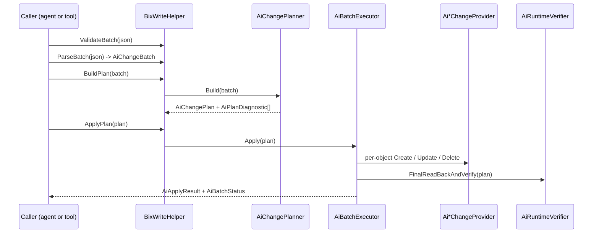

# Scenario: write changes back through the AI path

> Generated by `tools/` from the inputs in `source/`. Every statement below is backed by assembly metadata, IL, or a supplied export sample.
> Anything that could not be proven from those inputs is marked **Unknown** rather than guessed.

> This is deliberately **not** called "import a system as AiExport JSON". The AI
> side has a write path, but it is not the inverse of the export.

## The verdict

A write-back path exists, but it is not a symmetric importer for the AiExport document.

## What exists

```
BixWriteHelper.ValidateBatch(string)                    // structural lint
BixWriteHelper.ParseBatch(string)      : AiChangeBatch
BixWriteHelper.BuildPlan(AiChangeBatch): AiChangePlan
BixWriteHelper.ApplyPlan(AiChangePlan) : AiApplyResult
BixWriteHelper.SerializePlan(AiChangePlan)   : string
BixWriteHelper.SerializeResult(AiApplyResult): string
```

Exposed over HTTP by `Barsa.Ai.Host.AiHttpServer`: `HandleLint`, `HandlePlan`,
`HandleApply`.

## Flow



## Change providers

15 providers, one per concept:

- `Barsa.Meta.DataExchange.AiBusinessRuleChangeProvider`
- `Barsa.Meta.DataExchange.AiDynamicCommandChangeProvider`
- `Barsa.Meta.DataExchange.AiDynamicObjectChangeProvider`
- `Barsa.Meta.DataExchange.AiEntityChangeProvider`
- `Barsa.Meta.DataExchange.AiFieldChangeProvider`
- `Barsa.Meta.DataExchange.AiFolderChangeProvider`
- `Barsa.Meta.DataExchange.AiGenericChangeProvider`
- `Barsa.Meta.DataExchange.AiListRelationChangeProvider`
- `Barsa.Meta.DataExchange.AiRelationChangeProvider`
- `Barsa.Meta.DataExchange.AiReportChangeProvider`
- `Barsa.Meta.DataExchange.AiSingleRelationChangeProvider`
- `Barsa.Meta.DataExchange.AiSystemChangeProvider`
- `Barsa.Meta.DataExchange.AiUniqueConstraintChangeProvider`
- `Barsa.Meta.DataExchange.AiViewChangeProvider`
- `Barsa.Meta.DataExchange.AiWorkflowChangeProvider`

That list is itself a coverage statement: it names what the AI write path can
actually create, update and delete.

## Operations and outcomes

| Enum | Members |
|---|---|
| `AiChangeOperation` | `Create`, `Update`, `Delete` |
| `AiBatchStatus` | `Succeeded`, `PartiallySucceeded`, `Failed` |
| `AiBatchErrorPolicy` | `ContinueIndependent`, `StopBatch` |
| `AiCommandStatus` | `Planned`, `Succeeded`, `Failed`, `Conflict`, `SkippedDependency`, `SkippedPolicy`, `Unsupported`, `VerificationFailed` |
| `AiSemanticReferenceLifecycle` | `StructuralRequired`, `PostCreateConfig`, `FinalWiring` |

## Not atomic

`AiBatchStatus` includes `PartiallySucceeded` and `AiBatchErrorPolicy` offers
`ContinueIndependent` alongside `StopBatch`. A batch is therefore **explicitly
permitted to half apply**, and the caller chooses which behaviour it wants.
**Confidence: Verified** — this is an enum member list, not an inference.

Contrast the legacy path, where atomicity remains Unknown.

## Reference resolution

References are resolved against the target at apply time rather than remapped
afterwards: `AiSemanticReferenceResolver`, `AiSemanticReferenceContract`,
`AiPlanReferenceBinding`, and `AiDeferredBindingEntry` for references that
cannot resolve yet. `AiSemanticReferenceLifecycle` orders the work into
`StructuralRequired`, `PostCreateConfig` and `FinalWiring` — which is the AI
path's answer to the problem `$IdEmbeddingFields` solves on the legacy side.

## What is not established

- Whether an AiExport projection document can be submitted to ApplyPlan unchanged. The input type is AiChangeBatch, which is a different document; no code path was found converting one to the other.
- Whether the HTTP surface in Barsa.Ai.Host.exe is the only caller of the write path, or whether the system builder UI exposes it too.

Per spec section 91 this is recorded as 'a different write model', not as 'AiExport cannot be imported'.
