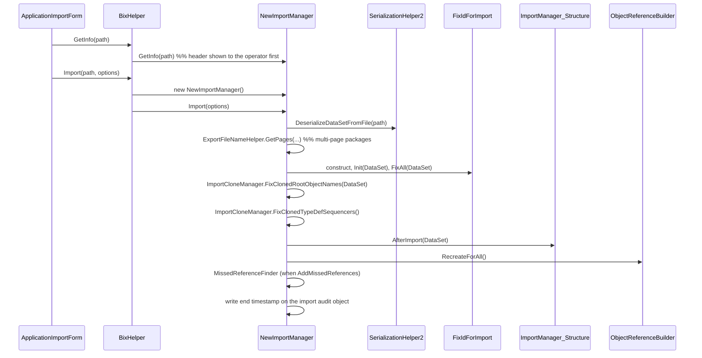

# Scenario: import a system

> Generated by `tools/` from the inputs in `source/`. Every statement below is backed by assembly metadata, IL, or a supplied export sample.
> Anything that could not be proven from those inputs is marked **Unknown** rather than guessed.

This is the direct counterpart of `export-system.md`, and the answer to "can the
same package be read back in and rebuilt?" — yes.

## Preconditions

- A logged-in Barsa session with a live database connection.
- A `.metaexport` file produced by the exporter.

## Input

`Barsa.Meta.DataExchange.ImportOptions`:

```
ctor(Barsa.SharedObjects.MultiSubProgress, string, bool)

bool            Simulate                        // dry run
string          FirstFilePath                   // first page of the package
MultiSubProgress Progress
bool            ingoreVersionExistsConfirm      // Barsa's spelling
Nullable<long>  CheckConstraintFixedRootObjectId
bool            IsClone                         // import as new identities
bool            AddMissedReferences
Action          ValidateBeforeImport            // caller-supplied gate
FixIdForImport  out_IdFixer                     // written back by the importer
DataSet         out_DataSet                     // written back by the importer
```

`Simulate` and `out_*` are the notable ones: the importer can be run without
committing, and it hands back both the raw DataSet and the id mapping it applied.

## Flow

Observed from the call sequence in `NewImportManager::Import`:



The audit object is a real Barsa metaobject, `MO_عمليات_ورود_اطلاعات`
("data import operation"), with setters for session, start time, end time, user,
file path, file size, machine name and infrastructure version. Imports are
recorded.

## API / types

| Member | Signature |
|---|---|
| Façade (prompting) | `BixHelper.Import(bool, bool) : bool` |
| Façade | `BixHelper.Import(string, bool, bool) : bool` |
| Façade (full) | `BixHelper.Import(string, bool, bool, Nullable<long>, bool, bool, out FixIdForImport, bool) : bool` |
| Façade (options) | `BixHelper.Import(string, ImportOptions) : bool` |
| With progress | `BixHelper.ImportWithProgress(string, bool, ImportOptions) : bool` |
| Engine | `NewImportManager.Import(ImportOptions) : void` |
| Read | `SerializationHelper2.DeserializeDataSetFromFile(string) : DataSet` |
| Preview | `NewImportManager.GetImportData(ImportOptions) : IActiveDataSource` |
| Preview façade | `BixHelper.ExtractData(ImportOptions) : IActiveDataSource` |
| Header only | `BixHelper.GetInfo(string) : string` |
| Id remap | `FixIdForImport.Init(DataSet)` / `FixAll(DataSet)` |
| Post-process | `ImportManager_Structure.AfterImport(DataSet) : void` |
| Rebuild graph | `ObjectReferenceBuilder.RecreateForAll() : void` |

## Preview before committing

`GetImportData` returns an `IActiveDataSource` — the same interface the *export*
tree consumes. `ApplicationImportForm.btnImportTest_Click` passes it, together
with `DbDataSource.GetCurrentDb()`, to `ImportTreeForm`, which renders the
package as a tree **with change icons** against the current database
(`ImportTreeControl.GetChangeIcon(CompareChangeTypeEnum)`).

So the package can be inspected, diffed against the live system and only then
applied. That symmetry — one tree interface for both directions — is the
cleanest confirmation that export and import are two ends of one design.

## Side effects

- Writes metadata into the target database.
- Creates an import audit metaobject.
- Rebuilds the object-reference graph for the whole installation.

## Failure modes

- `MetaMessageException` on paths reachable from `Import` — conditions Unknown.
- The UI warns that without a backup there is no way back
  (`'در صورت نداشتن پشتیبان امکان بازگشت به وضعیت اولیه وجود نخواهد داشت!'`),
  which is a strong hint that import is **not** transactional — but it is a UI
  string, not proof. Recorded in `RUNTIME-GAPS.md`.

## Evidence

Assembly metadata for every signature; call edges from IL; UI string literals;
both supplied samples for the input shape.

## Confidence

**CrossVerified** for the entry points and the package being readable back.
**Observed** for stage order. **Unknown** for atomicity, duplicate policy and
version gating.
