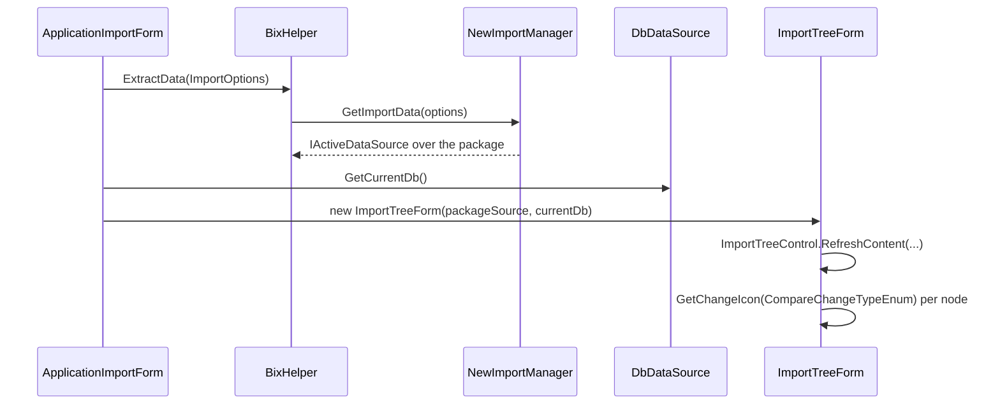

# Scenario: preview an import as a diff

> Generated by `tools/` from the inputs in `source/`. Every statement below is backed by assembly metadata, IL, or a supplied export sample.
> Anything that could not be proven from those inputs is marked **Unknown** rather than guessed.

Spec v3 section 22.

## Why this matters

A legacy package can be inspected and compared against the live system before
anything is written. The mechanism is neat: the importer hands back the **same
interface the export tree consumes**.

## Flow

`btnImportTest_Click` is the entry point; `btnImport_Click` is the one that
commits.

## States shown

| State | Value |
|---|---|
| `NoChange` | 0 |
| `Edited` | 1 |
| `New` | 2 |
| `Deleted` | 3 |

Rendered by `Barsa.Meta.Extra.Ui.Win.Editor.ImportTreeControl.GetChangeIcon(CompareChangeTypeEnum) : Bitmap`.

**Confidence: Verified** — read from the Field and Constant metadata
tables.

There is no Conflict state on the legacy side. The AI write path has one, in AiCommandStatus.

## Filtering

`ImportTreeControl.JustShowChanges` and `SomeNodeHasChange(TreeNodesCollection)`
let the operator collapse the tree to only what differs.

## What this does not establish

Whether the operator can **deselect** nodes in the preview and import a subset.
The control exposes no such API in its metadata, so **Unknown**.
