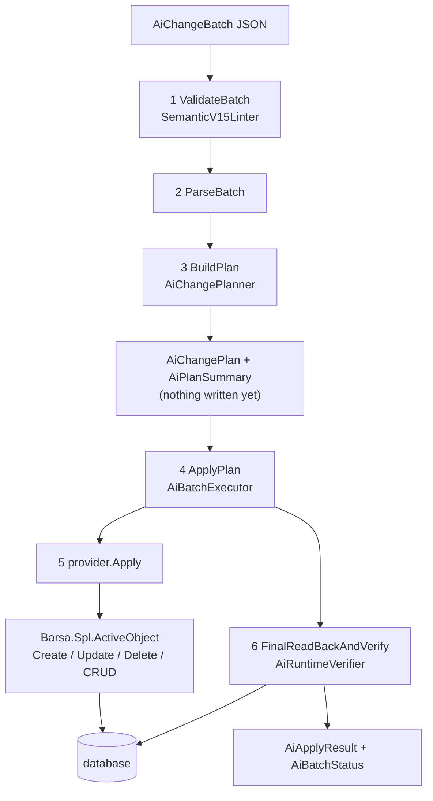

# Semantic write pipeline

> Generated by `tools/` from the inputs in `source/`. Every statement below is backed by assembly metadata, IL, or a supplied export sample.
> Anything that could not be proven from those inputs is marked **Unknown** rather than guessed.

**Confidence: Observed.** Every stage is a resolved call edge in
`Barsa.Meta.SemanticExchange`, which is not obfuscated, so the names are real.
Order is the order the calls appear in each method body. Branch conditions were
not reconstructed, so *which* stages run for a given command is Unknown except
where a guard is visible as a property read or a literal.

## The six stages

| Stage | Entry point | Produces |
|---|---|---|
| 1. Structural lint | `BixWriteHelper.ValidateBatch(string)` | `a throw, or nothing` |
| 2. Parse | `BixWriteHelper.ParseBatch(string)` | `AiChangeBatch` |
| 3. Plan | `BixWriteHelper.BuildPlan(AiChangeBatch)` | `AiChangePlan + AiPlanSummary + AiPlanDiagnostic[]` |
| 4. Apply | `BixWriteHelper.ApplyPlan(AiChangePlan)` | `AiApplyResult + AiCommandResult[] + AiBatchStatus` |
| 5. Mutate | `IAiChangeProvider.Apply(AiSemanticChange, AiBatchExecutionContext)` | `AiProviderApplyResult carrying the new RealId` |
| 6. Verify | `AiRuntimeVerifier.FinalReadBackAndVerify(plan, result)` | `AiRuntimeObject[] on AiApplyResult.RuntimeReadBack, plus per-command VerificationSucceeded` |

Note the shape: **plan and apply are separate calls**. A caller can build a
plan, read `AiPlanSummary.canApplyCleanly`, and decide — nothing is written
until `ApplyPlan`.

## Stage 3: planning, in body order

| Step | What it does |
|---|---|
| guard | null batch, profileVersion != 15, or StopBatch policy -> plan is invalid |
| `AiChangePlanner.AssignStableIds` | give every command a stable identity |
| `AiChangePlanner.BuildTempOwners` | map each tempId to the command that declares it |
| `AiProviderResolver.Resolve` | pick the provider whose CanHandle matches objectType |
| `AiChangePlanner.ValidateV15SemanticAuthority` | reject runtime identity that survived the lint |
| `AiSocWriteProjection.ValidateSoc` | separation-of-concerns check on the payload |
| `AiChangePlanner.PrepareV15ChangeForPlanInspection` | normalize the command so it can be inspected without mutating |
| `AiProviderPayloadPolicy.Prepare` | apply the provider's payload policy |
| `AiChangePlanner.ProjectCreateForStructuralValidation` | project a create far enough to validate its structure |
| `IAiChangeProvider.Validate` | the provider's own validation -> AiProviderValidation |
| `AiChangePlanner.ValidatePortableTransport` | asset and portability checks |
| `AiInfrastructureCapabilityResolver.ResolveForPlan` | bind required infrastructure capabilities, or fail with infrastructureBindingUnresolved |
| `IAiChangeProvider.BuildFingerprint` | record what the target looked like at plan time |
| `AiChangePlanner.CollectTempReferences` | derive Dependencies and RequiresApplyValidation |
| `AiChangePlanner.PlanDbNameRemaps` | plan physical column renames |
| `AiChangePlanner.ApplyFieldSiblingReconstructionOrder` | order sibling fields |
| `AiChangePlanner.SortByDependencies` | topologically order the commands |
| `AiChangePlanner.UpdateSummary` | fill AiPlanSummary |

## Stage 4: applying, in body order

| Step | What it does |
|---|---|
| guard | null plan, or a non-v15 planned command -> rejected before mutation |
| AiBatchExecutionContext | created, then SetProfileVersion and SetAssetRoot |
| `AiBatchExecutor.PreflightConflicts` | 'Target changed between plan and apply.' -- the fingerprint is rechecked |
| `AiBatchExecutor.PrepareChangeForExecution` | per command |
| `AiSocWriteProjection.ProjectForProvider` | project the payload for its provider |
| `AiBatchExecutor.ExtractInternalStages` | split off properties the lifecycle policy defers to phase 3 |
| `AiApplyLifecyclePolicy.StructuralPhase` | decide the command's phase |
| `AiBatchExecutionContext.BeginCommand` | open a per-command scope |
| `AiBatchExecutor.ResolveReferencesForValidation` | resolve selectors and tempIds to runtime ids |
| `AiBatchExecutor.ApplyStructuredDbNameRemaps` | apply planned column renames |
| `IAiChangeProvider.Validate` | re-validated at apply time when RequiresApplyValidation is set |
| `IAiChangeProvider.Apply` | the mutation; returns RealId |
| `AiBatchExecutionContext.RecordPersistedObject` | remember what was written |
| `AiBatchExecutionContext.RegisterTemporaryId` | bind the tempId to its new real id |
| `AiRuntimeVerifier.ReconcilePartialMutation` | when a command applied only partially and can be reconciled immediately |
| `AiBatchExecutor.OrderPhase3Stages` | order the deferred stages |
| `AiBatchExecutor.ExecuteInternalStages` | run them -- the FinalWiring pass |
| `AiBatchExecutor.ApplyFieldSiblingRuntimeOrder` | fix sibling order in the database |
| `AiRuntimeVerifier.FinalReadBackAndVerify` | read back and compare |
| `AiBatchExecutor.CalculateBatchStatus` | -> AiBatchStatus |

Two guards are worth calling out. The profileVersion gate is applied **again**
to the plan, so a plan built elsewhere cannot smuggle a non-v15 command past
it. And `PreflightConflicts` rechecks the fingerprint each provider recorded at
plan time, failing with *"Target changed between plan and apply."* — so a plan
is not blindly replayable against a system that moved underneath it.

## The deferral model

A reference that cannot resolve yet is not an error; it is deferred.

| Phase | Name | Meaning |
|---|---|---|
| 0 | `StructuralRequired` | what must exist before anything else can point at it |
| 1 | `PostCreateConfig` | configuration applied once the object exists |
| 2 | `FinalWiring` | wiring that can only be done when every object in the batch exists |

`AiApplyLifecyclePolicy.ShouldDeferToPhase3(change, property)` decides per property, classifying it as
one of: `dependentDetail`, `logic`, `reference`, `semanticValue`.

AiApplyLifecyclePolicy.CreateStructuralPlaceholder stands in for a reference that cannot resolve yet; the executor notes a runtime placeholder of -1 where a provider needs one.

Deferred work becomes an `AiInternalExecutionStage` carrying
`Planned`, `Change`, `Lifecycle`, `Name`, `PropertyPath`, `DependsOnPropertyPaths`, and
`AiBatchExecutor.OrderPhase3Stages` then `ExecuteInternalStages` run the final
wiring pass after every command has been applied.

AiApplyLifecyclePolicy.ResolveSubtype reads `fieldType` for a field and `relationKind` for a relation.

## Stage 5: what actually mutates

| Provider | objectType | Barsa types touched | Persists via |
|---|---|---|---|
| `AiBusinessRuleChangeProvider` | `businessRule` | 10 | `SaveSettingsAndReload` |
| `AiChangeProviderBase` | — | 21 | `ActiveObject.CRUD`, `ActiveObject.Update` |
| `AiDynamicCommandChangeProvider` | `dynamicCommand` | 11 | `ActiveObject.CRUD` |
| `AiDynamicObjectChangeProvider` | `dynamicObject` | 15 | **no write traced** |
| `AiEntityChangeProvider` | `entity` | 23 | `PrepareAndSave`, `SaveSettingsAndReload` |
| `AiFieldChangeProvider` | `field` | 30 | `PrepareAndSave` |
| `AiFolderChangeProvider` | `folder` | 26 | `ActiveObject.Create`, `ActiveObject.Delete`, `ActiveObject.Update` |
| `AiListRelationChangeProvider` | `list`, `relation`, `relationKind` | 5 | `PrepareAndSave` |
| `AiRelationChangeProvider` | `relation` | 47 | `PrepareAndSave` |
| `AiReportChangeProvider` | `report` | 13 | `ActiveObject.Create`, `ActiveObject.Delete`, `ActiveObject.Update` |
| `AiSingleRelationChangeProvider` | `relation` | 11 | `PrepareAndSave` |
| `AiSystemChangeProvider` | `system` | 34 | `ActiveObject.Create`, `ActiveObject.Update` |
| `AiUniqueConstraintChangeProvider` | `uniqueConstraint` | 17 | `SaveSettingsAndReload` |
| `AiViewChangeProvider` | `view` | 44 | `ActiveObject.Create`, `ActiveObject.Delete`, `ActiveObject.Update` |
| `AiWorkflowChangeProvider` | `workflow` | 85 | `ActiveObject.CRUD`, `ActiveObject.Create`, `ActiveObject.Update` |

**Persistence base:** Barsa.Spl.ActiveObject -- Create, Update, Delete and CRUD. No provider issues SQL of its own.

A provider with no ActiveObject call of its own persists through AiChangeProviderBase.PrepareAndSave or SaveSettingsAndReload, which run TypeDef.CheckTypeDefCRUDForUniqueness, then ActiveObject.CRUD, then TypeDefCacheNew.Reload. The entity and field providers take that route.

**No write traced for:** `AiDynamicObjectChangeProvider`, `AiGenericChangeProvider`. `AiGenericChangeProvider` is the fallback that matches no objectType literal, so having no write of its own is expected. For `AiDynamicObjectChangeProvider` the write was not located, which is consistent with its `applyClass` being `Dynamic` -- it writes instance rows rather than metamodel objects -- but the path is **Unknown**.

## Stage 6: verification is real

`AiRuntimeVerifier` has a `Verify*` per objectType — `VerifySystem`,
`VerifyEntity`, `VerifyField`, `VerifyView`, `VerifyReport`, `VerifyFolder`,
`VerifyRule`, `VerifyWorkflow`, `VerifyDynamicCommand`, `VerifyDynamicObject` —
plus `VerifyFieldSiblingRelativeOrder` and `VerifyFolderSiblingRelativeOrder`.

It reads each written object back out of the database and compares it against
what was asked for, canonicalizing both sides first (`CanonicalizeViewLayoutForVerify`,
`CanonicalizeConditionForVerify`, `NormalizeSemanticScalar`,
`TryCanonicalSemanticDate`, and `ImagePixelsEqual` for image payloads). A
mismatch becomes `AiCommandStatus.VerificationFailed` and
`ClassifyVerificationFailure` labels it.

So the pipeline does not trust its own writes — which is the strongest
indication that half-application is an expected outcome rather than an edge
case.

## What this means for a caller

| If you want | Do this |
|---|---|
| to check a batch without a server | `tools/lint_change_batch.py batch.json` |
| to know what would happen | `BuildPlan`, then read `AiPlanSummary.canApplyAny` / `canApplyAll` / `canApplyCleanly` |
| to know what did happen | `AiApplyResult.status`, then per-command `AiCommandResult.status`, `phase`, `failureClass` and `mutationStage` |
| the real ids of what you created | `AiApplyResult.temporaryIds`, which maps each tempId to its new id |
| to know whether a half-applied command was repaired | `needsReconcile`, `reconcileSucceeded` and `reconcileMessage` |
| to know whether Barsa agrees it worked | `verificationSucceeded`, and `runtimeReadBack` for what it found |

## Limits

Stage order is the order the calls appear in each method body. Branch conditions were not reconstructed, so which stages run for a given command is Unknown except where a guard is visible as a property read or a literal.
