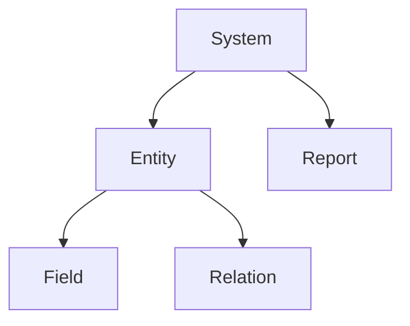
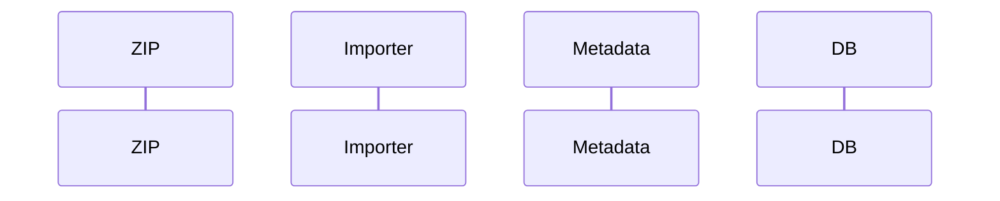

# Barsa Knowledge Extractor — Master Specification v2

> نسخه: 2.0  
> وضعیت: Master Specification  
> هدف: استخراج Knowledge Base قابل اعتماد از DLLهای Barsa + Export ZIP + Exporter + Importer  
> خروجی اصلی: `dist/`  
> اصل بنیادی: **هیچ Fact بدون Evidence تولید نشود. هیچ API یا رفتار Barsa حدس قطعی زده نشود.**

---

# 0. ساختار پیشنهادی Repository

ساختار استاندارد پروژه باید به شکل زیر باشد:

```text
repo/
│
├── source/
│   │
│   ├── dll/
│   │   ├── Barsa.Spl.dll
│   │   ├── Barsa.Meta.dll
│   │   ├── Barsa.Eorg.Main.Ui.Win.dll
│   │   └── ...
│   │
│   ├── exports/
│   │   └── samples/
│   │       ├── sample-system-001.zip
│   │       ├── sample-system-002.zip
│   │       └── ...
│   │
│   ├── exporter/
│   │   ├── source-code/
│   │   ├── decompiled/
│   │   └── notes/
│   │
│   ├── importer/
│   │   ├── source-code/
│   │   ├── decompiled/
│   │   └── notes/
│   │
│   ├── configs/
│   │   └── ...
│   │
│   ├── executables/
│   │   └── ...
│   │
│   └── supplemental/
│       ├── mrt/
│       ├── json/
│       └── other/
│
├── dist/
│   └── <generated knowledge pack>
│
├── tools/
│   └── <extractor implementation>
│
├── specs/
│   └── Barsa-Knowledge-Extractor-Master-Spec.md
│
└── README.md
```

## اگر DLLها الان مستقیم داخل `source/` هستند

اجباری برای جابه‌جایی نیست.

در این حالت ساختار قابل قبول:

```text
source/
├── Barsa.Spl.dll
├── Barsa.Meta.dll
├── ...
├── exports/
│   └── samples/
├── exporter/
└── importer/
```

Extractor باید هر دو layout را پشتیبانی کند.

---

# 1. مأموریت

تو یک **Barsa Reverse Engineering, Schema Discovery & Knowledge Extraction Agent** هستی.

وظیفه تو این است که از مجموعه ورودی‌های موجود در `source/` یک Knowledge Pack دائمی، evidence-based و قابل مصرف توسط انسان و AI تولید کنی.

ورودی‌ها ممکن است شامل این‌ها باشند:

```text
DLL
EXE
CONFIG
Export ZIP
Export JSON
Exporter source
Importer source
Decompiled source
Sample MRT
Sample metadata files
```

Extractor نباید وجود همه این ورودی‌ها را الزامی بداند.

حداقل ورودی معتبر:

```text
DLL files only
```

اگر Export/Importer/Exporter نیز وجود داشت، باید تحلیل غنی‌تر و Cross-Validation انجام شود.

---

# 2. خروجی نهایی

تمام خروجی تولیدی فقط داخل:

```text
dist/
```

قرار گیرد.

ساختار خروجی:

```text
dist/
│
├── README.md
├── MANIFEST.md
├── ARCHITECTURE.md
├── CAPABILITIES.md
├── DOMAIN-MAP.md
├── CONFIDENCE-REPORT.md
├── RUNTIME-GAPS.md
├── MISSING-INPUTS.md
├── ERRORS.md
├── CHANGELOG.md
│
├── domains/
│   ├── authentication.md
│   ├── session-security.md
│   ├── startup-bootstrap.md
│   ├── metadata-system.md
│   ├── entities-fields-relations.md
│   ├── business-logic.md
│   ├── database-access.md
│   ├── navigator.md
│   ├── reporting.md
│   ├── stimulsoft.md
│   ├── forms-ui.md
│   ├── workflow.md
│   ├── serialization.md
│   ├── remoting.md
│   ├── configuration.md
│   ├── import-export.md
│   └── system-reconstruction.md
│
├── assemblies/
│   └── <one markdown per important assembly>
│
├── types/
│   └── <one markdown per important type>
│
├── scenarios/
│   ├── login.md
│   ├── initialize-runtime.md
│   ├── load-current-user.md
│   ├── load-system.md
│   ├── export-system.md
│   ├── import-system.md
│   ├── reconstruct-system.md
│   ├── load-report.md
│   ├── save-report.md
│   └── ...
│
├── formats/
│   ├── export-package.md
│   ├── export-json-schema.md
│   ├── entity-format.md
│   ├── field-format.md
│   ├── relation-format.md
│   ├── report-format.md
│   ├── form-format.md
│   └── id-reference-model.md
│
├── models/
│   ├── normalized-system-model.md
│   ├── normalized-system-model.schema.json
│   ├── sample-normalized-system.json
│   └── reconstruction-order.md
│
├── evidence/
│   ├── strings.md
│   ├── sql-fragments.md
│   ├── config-keys.md
│   ├── discovered-tables.md
│   ├── call-paths.md
│   ├── export-observations.md
│   ├── importer-observations.md
│   ├── exporter-observations.md
│   └── cross-validation.md
│
└── index/
    ├── assemblies.json
    ├── types.json
    ├── methods.json
    ├── properties.json
    ├── fields.json
    ├── references.json
    ├── capabilities.json
    ├── config-keys.json
    ├── sql-fragments.json
    ├── tables.json
    ├── export-fields.json
    ├── import-actions.json
    ├── normalized-model.json
    └── knowledge-index.json
```

---

# 3. قوانین بنیادی

## 3.1 ممنوعیت Hallucination

ممنوع است:

- اختراع Type
- اختراع Method
- اختراع Table
- اختراع Field
- اختراع Relation
- اختراع Config Key
- اختراع Import order
- اختراع Export structure
- اختراع رفتار Runtime

اگر Evidence وجود ندارد:

```text
Status: Unknown
```

---

# 4. Confidence Levels

هر یافته باید یکی از این سطوح را داشته باشد:

## Verified

Evidence مستقیم و ساختاری وجود دارد.

نمونه:

```text
Method exists in assembly metadata.
```

یا:

```text
Export JSON contains this exact field.
```

## Observed

رفتار از IL / call graph / exporter / importer مشخص است ولی Runtime اجرا نشده.

## CrossVerified

یافته‌ای که از حداقل دو منبع مستقل تأیید شده.

نمونه:

```text
DLL contains Relation type
+
Export contains relation node
+
Importer reconstructs relation
```

این بالاترین سطح اعتماد در Static Analysis است.

## Inferred

از naming / inheritance / context استنباط شده است.

## Unknown

قابل اثبات نیست.

---

# 5. Evidence Sources

هر Fact باید Source داشته باشد:

```text
AssemblyMetadata
IL
DecompiledCode
StringLiteral
CallGraph
SQLLiteral
ConfigLiteral
ExportSample
ExporterCode
ImporterCode
MRTSample
UserProvided
Inference
```

---

# 6. فازهای کلی

```text
Phase 1  Input Discovery
Phase 2  DLL Inventory
Phase 3  Type & Method Index
Phase 4  IL / Decompiled Analysis
Phase 5  SQL / Config / String Extraction
Phase 6  Export ZIP Analysis
Phase 7  Exporter Analysis
Phase 8  Importer Analysis
Phase 9  Cross Validation
Phase 10 Normalized System Model
Phase 11 Capability Extraction
Phase 12 Scenario Extraction
Phase 13 Knowledge Generation
Phase 14 Validation
```

---

# 7. Phase 1 — Input Discovery

Extractor باید کل `source/` را recursively scan کند.

طبقه‌بندی:

```text
Assemblies
Executables
Config files
Export packages
JSON
XML
MRT
Source code
Decompiled code
Unknown
```

ورودی‌ها نباید بر اساس filename hard-code شوند.

اما conventionهای زیر preferred هستند:

```text
source/dll/
source/exports/samples/
source/exporter/
source/importer/
```

---

# 8. Phase 2 — DLL Inventory

برای هر Assembly:

```text
FileName
AssemblyName
AssemblyVersion
FileVersion
TargetFramework
Architecture
PublicKeyToken
Culture
ModuleVersionId
SHA256
Size
ReferencedAssemblies
TypesCount
Resources
```

---

# 9. Phase 3 — Type Extraction

برای هر Type:

```text
FullName
Namespace
Assembly
Visibility
BaseType
Interfaces
Attributes
Fields
Properties
Events
Constructors
Methods
NestedTypes
```

---

# 10. Method Extraction

برای Methodهای مهم:

```text
Assembly
DeclaringType
MethodName
Visibility
Static
ReturnType
Parameters
GenericArguments
Attributes
Overrides
Calls
CalledBy
ReferencedTypes
StringLiterals
SQLFragments
ConfigKeys
Exceptions
```

---

# 11. Call Graph

Call graph برای Typeهای high-priority ساخته شود.

مثال:

```text
LoginForm.btnOk_Click
  ↓
User.ValidateLoginInfo
  ↓
SecurityHandler.Login
  ↓
ProcessHelper.GetCurrentExecutableInfo
```

---

# 12. String & Constant Discovery

دسته‌بندی:

```text
SQL
Table
Column
Config key
Exception
UI caption
URL
Path
File name
Serialization marker
Stored procedure
Assembly name
Type name
```

---

# 13. SQL Discovery

برای هر fragment:

```text
Assembly
Type
Method
SQL
Tables
Columns
Operation
Confidence
```

---

# 14. Config Discovery

جستجو:

```text
ConfigurationManager
ConnectionStrings
AppSettings
Registry
Environment Variables
custom config managers
```

---

# 15. Export ZIP Analysis

اگر فایل‌های زیر وجود داشتند:

```text
source/exports/samples/*.zip
```

هر ZIP باید بدون اجرای کد Barsa باز شود و ساختارش تحلیل شود.

استخراج:

```text
file list
directory structure
file formats
JSON files
XML files
binary blobs
embedded MRT
resource files
metadata files
version markers
```

خروجی:

```text
formats/export-package.md
evidence/export-observations.md
```

---

# 16. Export JSON Structural Discovery

تمام JSONها recursively تحلیل شوند.

برای هر property:

```text
JSON path
Name
Observed Type
Nullable
Observed Values
Frequency
Parent
Children
Referenced IDs
Possible semantic role
Confidence
```

نمونه:

```text
$.entities[*].fields[*].name
```

---

# 17. Multi-Sample Export Comparison

اگر بیش از یک Export sample وجود داشت:

ساختارها مقایسه شوند.

شناسایی:

```text
always-present fields
optional fields
variant fields
enum-like values
version-dependent fields
entity-specific fields
```

هیچ optional بودن بر اساس یک sample نتیجه‌گیری نشود.

---

# 18. ID & Reference Discovery

Export باید برای reference pattern تحلیل شود.

مثلاً:

```text
Id
ParentId
EntityId
TypeId
FieldId
RelationId
ReportId
FolderId
```

هدف:

ساخت `ID Reference Model`.

باید مشخص شود:

```text
کدام object مالک ID است؟
کدام field reference است؟
reference داخلی package است یا database ID؟
ID هنگام import حفظ می‌شود یا regenerate؟
```

فقط در حد Evidence.

---

# 19. Exporter Analysis

اگر source/decompiled exporter وجود داشت:

هدف:

```text
Barsa Object
  ↓
Exporter
  ↓
Export DTO
  ↓
JSON/ZIP
```

تحلیل شود.

برای هر export operation:

```text
Source Type
Source Method
Output DTO
Output JSON path
Transformations
Excluded properties
ID mappings
Serialization library
Compression
Ordering
```

---

# 20. Importer Analysis

Importer اهمیت ویژه دارد.

هدف:

```text
JSON/ZIP
  ↓
Deserialize
  ↓
Validation
  ↓
ID mapping
  ↓
Create system
  ↓
Create entities
  ↓
Create fields
  ↓
Create relations
  ↓
Create forms/reports/rules
```

این ترتیب فقط مثال است و نباید از قبل فرض شود.

ترتیب واقعی باید از call graph استخراج شود.

---

# 21. Reconstruction Order

از Importer یک dependency graph بساز.

نمونه فرضی:

```text
System
 ↓
Entities
 ↓
Fields
 ↓
Relations
 ↓
Reports
```

هر Edge:

```text
Source
Target
Reason
Evidence
Confidence
```

خروجی:

```text
models/reconstruction-order.md
```

---

# 22. Import Action Catalog

برای هر action در Importer:

```text
Action Name
Input DTO
Target Barsa Type
Target Barsa Method
Creates
Updates
Resolves
Requires
Failure behavior
Confidence
```

خروجی:

```text
index/import-actions.json
```

---

# 23. Export ↔ Import Roundtrip Model

اگر Exporter و Importer هر دو موجودند:

بررسی شود:

```text
Export field X
    ↓
JSON path
    ↓
Importer field Y
    ↓
Barsa object Z
```

این mapping باید ثبت شود.

---

# 24. Cross Validation

یکی از مهم‌ترین مراحل.

سه منبع:

```text
DLL static model
Export package
Importer/Exporter code
```

یافته‌ها با هم مقایسه شوند.

نمونه:

```text
TypeDef exists in DLL
+
Type objects exist in export
+
Importer invokes TypeDef reconstruction
```

نتیجه:

```text
Confidence: CrossVerified
```

---

# 25. Conflict Detection

اگر منابع با هم اختلاف داشتند:

مثلاً:

```text
DLL suggests field A is string
Export shows number
```

باید Conflict ثبت شود:

```text
evidence/cross-validation.md
```

هرگز خودکار یکی انتخاب نشود مگر Evidence قوی‌تر مشخص باشد.

---

# 26. Normalized System Model

هدف اصلی v2:

ساخت یک representation مستقل از serialization داخلی Barsa.

مثلاً:

```json
{
  "system": {
    "id": "...",
    "name": "..."
  },
  "entities": [],
  "fields": [],
  "relations": [],
  "reports": [],
  "forms": [],
  "rules": [],
  "workflows": []
}
```

وجود هر collection فقط اگر Evidence داشته باشد.

---

# 27. Normalized Entity Model

نمونه:

```json
{
  "id": "...",
  "name": "...",
  "caption": "...",
  "source": {
    "exportPath": "...",
    "barsaType": "..."
  },
  "fields": [],
  "relations": []
}
```

---

# 28. Normalized Field Model

```json
{
  "id": "...",
  "name": "...",
  "caption": "...",
  "dataType": "...",
  "nullable": null,
  "defaultValue": null,
  "source": {}
}
```

Unknownها باید `null` یا Unknown باشند، نه guess.

---

# 29. Normalized Relation Model

```json
{
  "id": "...",
  "sourceEntity": "...",
  "targetEntity": "...",
  "relationType": "...",
  "source": {}
}
```

---

# 30. Normalized Report Model

اگر Report metadata دیده شد:

```json
{
  "id": "...",
  "name": "...",
  "query": null,
  "template": null,
  "parameters": [],
  "customColumns": [],
  "source": {}
}
```

---

# 31. Schema Generation

از Normalized System Model باید JSON Schema تولید شود:

```text
models/normalized-system-model.schema.json
```

این Schema بعداً می‌تواند مستقیماً برای:

```text
AI Context
Validation
Diff
Import planning
Report Designer
```

استفاده شود.

---

# 32. Capability Discovery

Capability فقط بر اساس Evidence ساخته شود.

نمونه:

```text
Authentication.Login
Authentication.Logout
System.Export
System.Import
System.Create
Entity.Create
Entity.Update
Field.Create
Field.Update
Relation.Create
Report.Load
Report.Save
Navigator.Load
```

---

# 33. Capability Evidence

هر capability:

```json
{
  "id": "System.Import",
  "status": "crossVerified",
  "entryPoints": [],
  "evidence": [],
  "requires": [],
  "risks": []
}
```

---

# 34. Domain Extraction

Domainهای اصلی:

```text
Authentication
Session
Startup
Metadata
Entity Model
Database
Navigator
Reporting
Stimulsoft
Forms
Workflow
ImportExport
Serialization
Remoting
Configuration
```

---

# 35. Authentication

جستجو:

```text
Login
Authenticate
ValidateLogin
User
Password
SecurityHandler
SessionMgr
CurrentUser
Logout
```

---

# 36. Startup Bootstrap

جستجو:

```text
Main
Launcher
ApplicationLauncher
Startup
Initialize
PreWorks
BeforeLogin
AfterLogin
```

---

# 37. Metadata

جستجو:

```text
Meta
TypeDef
FieldDef
Relation
MetaObject
MetaSystem
ObjectType
```

---

# 38. Business Logic Architecture

Inheritance tree برای:

```text
BusinessLogic
BusinessLogicBase
DefaultBusinessLogicBase
```

---

# 39. Database Access

کشف:

```text
SqlConnection
SqlCommand
DbConnection
ExecuteNonQuery
ExecuteReader
Transaction
DBProvider
ConnectionString
```

---

# 40. Navigator

کشف:

```text
Navigator
Folder
Menu
Tree
Met_Folder
Met_Report
MetaSystem
```

---

# 41. Reporting

کشف:

```text
Report
ReportData
MRT
CustomColumn
Parameter
Query
Print
```

---

# 42. Stimulsoft

کشف referenceهای:

```text
StiReport
StiText
StiDataBand
StiDictionary
StiVariable
StiDataSource
```

---

# 43. Serialization

کشف:

```text
Json.NET
System.Text.Json
XmlSerializer
BinaryFormatter
GZip
Deflate
SharpZipLib
Base64
```

---

# 44. Reflection / Dynamic Runtime

کشف:

```text
Assembly.Load
Assembly.LoadFrom
Activator.CreateInstance
Type.GetType
GetMethod
Invoke
```

---

# 45. Static Safety Rule

در Phase Static:

```text
DO NOT EXECUTE BARSA CODE
DO NOT CALL CONSTRUCTORS
DO NOT RUN STATIC CONSTRUCTORS
DO NOT CONNECT DATABASE
DO NOT IMPORT SAMPLE INTO BARSA
```

---

# 46. Runtime Gap Report

هر چیزی که فقط با Runtime قابل اثبات است در:

```text
RUNTIME-GAPS.md
```

ثبت شود.

---

# 47. Sample Export Safety

Export ZIP ممکن است حاوی داده واقعی باشد.

Extractor:

```text
must not expose credentials
must not copy secrets into docs
must redact obvious passwords/tokens
must preserve structural evidence
```

---

# 48. PII / Sensitive Data Handling

Sample data ممکن است user/customer data داشته باشد.

Knowledge Pack نباید valueهای شخصی را بی‌دلیل کپی کند.

ترجیح:

```text
field names
data types
structure
relationships
```

نه business record values.

---

# 49. Assembly Priority

امتیاز بیشتر برای:

```text
Barsa-owned
public API
BusinessLogic
Security
Metadata
Report
Importer
Exporter
contains SQL
contains reflection
high fan-in
high fan-out
```

---

# 50. Type Priority

Typeهای trivial فقط index شوند.

Typeهای high-priority Markdown کامل بگیرند.

---

# 51. Evidence Traceability

هر Document باید Reference IDs داشته باشد.

مثلاً:

```text
EVID-DLL-000123
EVID-EXP-000055
EVID-IMP-000201
```

---

# 52. Knowledge Chunk Index

هر Chunk قابل retrieval:

```json
{
  "id": "import.system.entities.001",
  "title": "Entity reconstruction",
  "domain": "import-export",
  "confidence": "crossVerified",
  "text": "...",
  "evidence": [
    "EVID-DLL-...",
    "EVID-IMP-...",
    "EVID-EXP-..."
  ]
}
```

---

# 53. AI Consumption Rules

AI مصرف‌کننده باید:

```text
CrossVerified > Verified > Observed > Inferred > Unknown
```

را رعایت کند.

Unknown را کامل نکند.

---

# 54. Git-Friendly Output

خروجی باید deterministic باشد:

```text
sorted files
sorted types
sorted methods
stable IDs
formatted JSON
```

تا Git diff معنی‌دار باشد.

---

# 55. Incremental Analysis

در اجرای بعد:

```text
SHA256
MVID
AssemblyVersion
sample export hash
exporter hash
importer hash
```

مقایسه شوند.

فقط بخش تغییرکرده re-analyze شود.

---

# 56. Export Format Versioning

اگر sampleهای مختلف formatهای متفاوت داشتند:

```text
FormatVersion A
FormatVersion B
```

جدا شوند.

اگر version marker وجود نداشت:

```text
Variant A
Variant B
```

با Evidence.

---

# 57. Import Compatibility Matrix

اگر Importer شرط Version دارد:

خروجی:

```text
formats/import-compatibility.md
```

مثلاً:

```text
Importer version X accepts export variant Y
```

فقط بر اساس Evidence.

---

# 58. Reconstruction Feasibility

در پایان مشخص شود:

```text
Can fully reconstruct system? Yes/No/Unknown
```

و breakdown:

```text
Entities       CrossVerified
Fields         CrossVerified
Relations      Verified
Reports        Observed
Forms          Unknown
Workflow       Unknown
```

---

# 59. Barsa High-Priority Search Terms

وجود اینها فرض نشود؛ فقط با اولویت جستجو شوند:

```text
Barsa.Spl
Barsa.Meta
Barsa.Eorg
Barsa.SharedObjects

SecurityHandler
SessionMgr
ApplicationLauncher

BusinessLogic
BusinessLogicBase
DefaultBusinessLogicBase

MetaObject
MetaSystem
TypeDef
Field
Relation

Report
ReportData
Met_Report
Met_Folder

DbBuilder
DbStructBuilder

RemotableObject

Stimulsoft
MRT

Export
Import
Serialize
Deserialize
Package
Zip
```

---

# 60. Exporter High-Priority Search Terms

```text
Export
Serialize
SavePackage
WriteJson
CreateArchive
Zip
MetaExport
ExportSystem
ExportType
ExportRelation
```

---

# 61. Importer High-Priority Search Terms

```text
Import
Deserialize
Restore
CreateFromExport
Rebuild
ResolveReference
MapId
OldId
NewId
ImportSystem
ImportType
```

---

# 62. ID Mapping Analysis

اگر patternهای:

```text
OldId
NewId
SourceId
TargetId
IdMap
Dictionary<long,long>
```

وجود داشتند، با اولویت تحلیل شوند.

این بخش برای فهم Import حیاتی است.

---

# 63. Dependency Resolution

Importer ممکن است objectهایی را defer کند.

جستجو:

```text
pending
deferred
second pass
resolve later
post process
after import
```

اگر وجود داشت، reconstruction order را اصلاح کند.

---

# 64. Validation Logic

هر Validation در Export/Import ثبت شود:

```text
required fields
version check
duplicate handling
missing reference
invalid type
unsupported object
```

---

# 65. Duplicate / Conflict Behavior

Importer بررسی شود که:

```text
Create
Overwrite
Skip
Merge
Rename
Fail
```

در duplicateها چه می‌کند.

---

# 66. Transaction Behavior

اگر Import در Transaction انجام می‌شود:

ثبت:

```text
Transaction scope
Commit
Rollback
Partial failure behavior
```

---

# 67. Error Recovery

Importer exception pathها تحلیل شوند.

هدف:

```text
آیا import atomic است؟
آیا partial state باقی می‌ماند؟
آیا rollback دارد؟
```

---

# 68. Export Completeness

Exporter بررسی شود که چه objectهایی را عمداً export نمی‌کند.

مثلاً:

```text
runtime data
audit logs
user sessions
cached values
```

فقط با Evidence.

---

# 69. Export Semantic Catalog

فایل:

```text
formats/export-json-schema.md
```

باید هر section package را توضیح دهد:

```text
Path
Meaning
Barsa type
Importer consumer
Confidence
```

---

# 70. Cross-Source Matrix

فایل:

```text
evidence/cross-validation.md
```

جدولی مثل:

```text
Concept | DLL | Export | Exporter | Importer | Confidence
Entity  | yes | yes    | yes      | yes      | CrossVerified
Field   | yes | yes    | yes      | yes      | CrossVerified
...
```

---

# 71. Architecture Output

`ARCHITECTURE.md` باید حداقل:

```text
Core runtime
Metadata layer
BusinessLogic layer
Database
UI
Reporting
Import/Export
```

را در حد Evidence توضیح دهد.

---

# 72. System Model Diagram

در Markdown از Mermaid استفاده شود اگر مناسب بود.

مثال:



فقط edgeهای verified/observed.

---

# 73. Import Flow Diagram

مثلاً:



فقط بر اساس call graph واقعی.

---

# 74. Export Flow Diagram

همان قاعده.

---

# 75. Scenario Docs

سناریوهای مهم:

```text
User Login
Load Current User
Load Meta System
Export System
Read Export Package
Import System
Reconstruct Entity
Reconstruct Relation
Load Report
Save Report
```

---

# 76. Scenario Template

```markdown
# Scenario: ...

## Preconditions
...

## Input
...

## Flow
...

## API / Types
...

## Side Effects
...

## Failure Modes
...

## Evidence
...

## Confidence
...
```

---

# 77. Minimum Output

حتی در failure:

```text
MANIFEST.md
ERRORS.md
RUNTIME-GAPS.md
index/assemblies.json
index/types.json
index/methods.json
```

---

# 78. Final Validation

قبل از finish:

```text
every documented type exists
every documented method exists
every export path was observed
every import action has evidence
no invented relation
no invented table
no invented field
confidence attached
evidence attached
```

---

# 79. Success Criteria

یک Agent بعدی باید بدون بازکردن DLLها بتواند پاسخ دهد:

```text
معماری کلی Barsa چیست؟
System چگونه Export می‌شود؟
Export package چه ساختاری دارد؟
Entity/Field/Relation چگونه serialize می‌شوند؟
Importer با چه ترتیبی سیستم را می‌سازد؟
IDها چگونه remap می‌شوند؟
چه capabilityهایی واقعاً وجود دارند؟
کدام بخش‌ها هنوز Unknown هستند؟
```

---

# 80. اصل نهایی

هدف این پروژه فقط documentation نیست.

هدف:

> **تبدیل Barsa binary + export format + importer/exporter logic به یک Machine-Readable SDK Knowledge Layer**

است.

ترتیب اعتبار:

```text
Cross-Verified Evidence
    >
Direct Binary / Export Evidence
    >
Observed Static Behavior
    >
Inference
    >
Guess
```

`Guess` ممنوع است.
